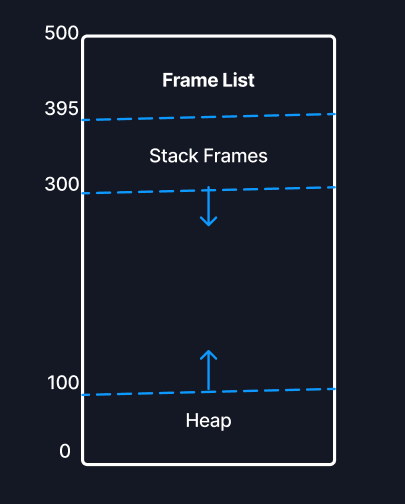

# Stack and Heap Memory Management
This program was made on receiving the homework assignment for the course ```CS232 Operating Systems```. The program would simulate a simple stack and heap memory of 500 bytes with a stack starting from the top growing downwards, taking 200 bytes, and a heap growing from the bottom to the top, taking 300 bytes. In the stack, we first have the Frame Status List to store a Stack Frame metadata, and immediately below the list we have the stack frames themselves storing the stack data.

### Memory Layout and Design


A character array was used to simulate the 500 bytes of memory. The code is contained in the [memorysystem.c](memorysystem.c) file.

The accompanying ```Makefile``` has commands for compiling ```memorysystem.c``` file and running the generated executable.

To compile: ```make build```
To run: ```make run```

The program has a command line like interface where the user can input their commands and see the output. The commands are listed below.

### Supporting Commands

#### CF - Create Frame
syntax: ```CF <function name> <function address>```
Creates a frame of the given name at the given address. Frame name can't exceed 8 characters. The frame is created on top of the stack. A maximum of 5 frames are supported.

#### DF - Delete Frame
syntax: ```DF```
Deletes the frame at the top of the stack

#### CI - Create Integer Local Variable
syntax: ```CI <int name> <int value>```
Creates an integer of the specified value on the stack.

#### CD - Create Double Local Variable
syntax: ```CD <double name> <double value>```
Creates a double of the specified value on the stack.

#### CC - Create Character Local Variable
syntax: ```CC <character name> <character value>```
Creates a character of the specified value on the stack.

#### CH - Create a Character Buffer on the Heap
syntax: ```CH <buffer name> <buffer size>```
Creates a buffer on the heap of the given name and size. On the heap an additional 8 bytes are also stored that contain the metadata of the heap. A free free list and an allocated list are maintained along with the heap to keep track of free regions and allocated regions.

#### DH - Delete a Buffer
syntax: ```DH <buffer name>```
Deletes a buffer of the given name from the heap. Also updates the free regions and allocated regions accordingly.

For further clarifications, the attached [report](Report.pdf) can also be viewed.
